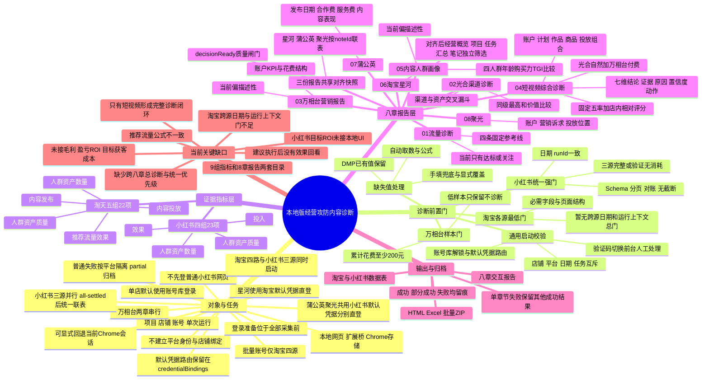
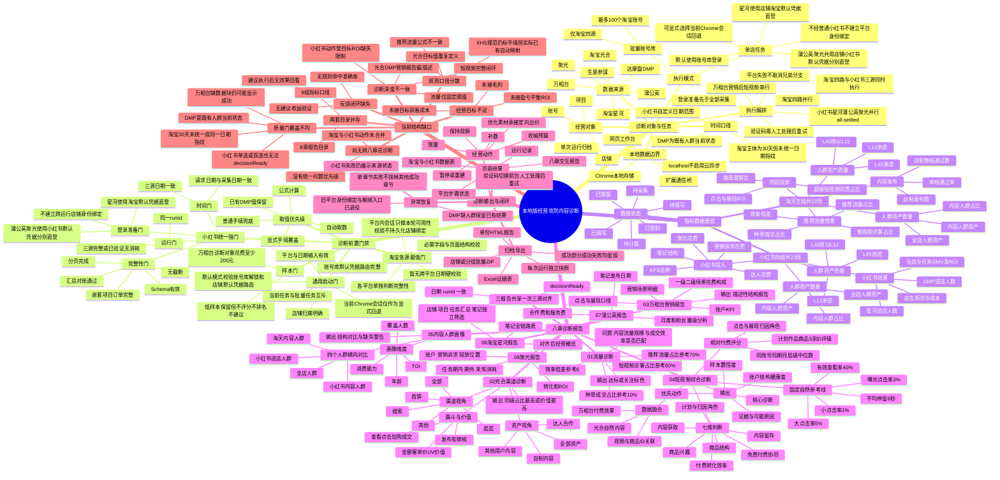

# 本地版经营攻防内容诊断框架脑图（现状版）

> 代码基线：本地候选 `2.37.24`，梳理日期：2026-08-21。
>
> 这份文档描述“当前代码实际上怎样诊断”，不是未来理想方案。

## 先看结论

当前本地版不是一套单一的诊断引擎，而是三层叠加：

1. **指标口径层**：9 组、45 项经营指标，负责采集、公式计算、手填兜底和状态说明。
2. **八章报告层**：按流量、光合、万相台营销、短视频、DMP、淘宝星河、蒲公英、聚光组织结果。
3. **决策规则层**：完整的“结论 → 证据 → 原因 → 置信度 → 动作”主要集中在短视频诊断；小红书具备质量闸门和目标 ROI 动作框架；其余章节多数仍是阈值标色或结构对比。

因此，当前工具更准确的定位是：

> **多平台取数与证据归档系统 + 局部成熟的自动诊断引擎。**

## 一页总览脑图



## 完整结构脑图

<details>
<summary>展开查看全部节点</summary>



</details>

## 八章的实际诊断深度

| 章节 | 当前回答的问题 | 当前判断方式 | 输出深度 |
|---|---|---|---|
| 01 流量诊断 | 内容流量规模和种草成交效率是否匹配 | 4 条固定参考线，`good/watch` 标色 | 指标信号，暂无原因和动作 |
| 02 光合渠道诊断 | 哪个渠道、哪类资产贡献更高 | 父子占比、同级最高、客单价和 UV 价值 | 横向对比，暂无绝对达标判断 |
| 03 万相台营销报告 | 预算花在哪里、各场景表现怎样 | 花费结构和场景指标可视化 | 描述性报告，暂无自动建议 |
| 04 短视频诊断 | 自然内容是否强、付费能否有效放大、预算该投向哪里 | 固定自然目标 + 账号内相对评分 + 样本门 + 置信度 | 当前唯一完整诊断闭环 |
| 05 内容人群画像 | 四类人群在年龄和购买力上有什么差异 | 覆盖人数、比例、TGI 横向对比 | 画像证据，暂无差异显著性和行动规则 |
| 06 淘宝星河 | 项目、任务汇总和独立笔记结果如何 | 星河原生汇总 + 三源对齐后成本/ROI | 经营结果视图，依赖统一质量门 |
| 07 蒲公英 | 达人合作投入与内容表现如何 | 发布日期闭区间 + 费用拆分 + 月度/粉丝量级 | 平台事实与内容分布 |
| 08 聚光 | 广告消耗与转化在账户/诉求/模式间如何分布 | 最多三层分组 + 星河任务期对齐 + 15 日转化 | 投放分析，依赖统一质量门 |

## 当前执行顺序与容错

```text
单店默认：解锁账号库并读取店铺默认凭据路由
          ├─ 星河 ← 淘宝默认凭据直登淘宝星河
          └─ 蒲公英 + 聚光 ← 共用小红书默认凭据，分别直登各自平台
             （不先登普通小红书网页，不建立平台身份绑定）
显式回退：沿用当前 Chrome 会话，不执行账号库自动登录，不建立持久化平台身份绑定
                           ↓
                 全部采集开始前完成登录准备
                           ↓
生意参谋 ────────────────────────────────┐
光合 ────────────────────────────────────┤
DMP ─────────────────────────────────────┤
万相台营销 → 万相台短视频 ───────────────┤─ 所选任务并行推进
星河 ───┬─ 三源并行取数（all-settled）───┤
蒲公英 ─┤                                  │
聚光 ───┘                                  │
                                             ↓
                         三源统一校验联表；全部所选任务结束后保存归档
```

- 单店任务默认从已解锁账号库读取所选店铺的默认凭据路由：星河用淘宝凭据直登淘宝星河，蒲公英与聚光共用同一个小红书凭据并分别直登各自官方平台；不先登录普通小红书网页，不建立额外平台身份绑定。用户也可以显式选择“当前 Chrome 会话”回退模式。
- 账号库 `credentialBindings` 继续保留，其含义是“店铺默认凭据路由”；旧 `xhsStoreAccountBindingsV1` 真实身份绑定、首次绑定、错配门禁和解绑 UI 均已退役。
- 账号库模式先完成平台登录准备，再启动任何采集；当前会话模式先在任务自有标签页确认平台状态。登录或采集期间遇到验证码或安全验证时，激活对应标签页并保持单店任务等待，由人工完成后只继续受影响的三源步骤，不把验证码当成可自动绕过步骤。
- 每个平台外层最多尝试 5 次；验证码、账号密码、无权限、缺人群包等明确问题不做无意义重试。
- 每个平台完成时立即保存进度；普通登录、会话预检或取数失败只收敛当前平台，不取消兄弟分支。小红书三源保持并行，并在 all-settled 全部落定后才生成统一联表快照与运行归档。
- 只要一个所选步骤成功，其余失败或部分完成，整单仍会以 `partial` 归档并保留可用章节。
- 当前 localhost 数据链路是“网页工作台 ↔ 扩展通信桥 ↔ Chrome 本地存储”；本地页面不启用 `cloud-sync`。
- 在线账号库属于团队工作区：换电脑登录后下载同一份密文，再输入团队主密码解锁；退出只清明文，owner/admin 团队重置则写入持久删除标记，阻止旧电脑复活密文。

## 当前核心规则快照

### 1. 流量固定参考线

| 指标 | 公式或来源 | 当前参考线 |
|---|---|---:|
| 短视频访客占比 | 短视频访客 / 店铺访客 | ≥ 60% |
| 种草成交金额占比 | 光合 30 日口径 | ≥ 10% |
| 效率倍差 | 短视频访客占比 / 种草成交金额占比 | ≥ 6 |
| 推荐流量占比 | 当前代码存在两种公式，见“需要先统一的口径” | ≥ 70% |

### 2. 短视频自然内容固定目标

| 诊断环节 | 指标 | 当前目标 |
|---|---|---:|
| 内容获取 | 曝光点击率 | ≥ 3% |
| 内容留存 | 有效查看率 | ≥ 40% |
| 内容留存 | 次均停留时长 | ≥ 6 秒 |
| 商品兴趣 | 大点击率 | ≥ 5% |
| 商品兴趣 | 小点击率 | ≥ 1% |

单个作品五项中达到至少 3 项视为“自然强”；0～1 项视为“自然弱”。自然样本置信度另外按曝光量或查看量标为高、中、低，但低置信度目前不会完全阻断好坏判断。

### 3. 短视频付费相对评分

先过滤累计花费 `< ¥200` 的计划、作品和商品，再以当前账号、同期、同层级合格样本的中位数作为基准。

计划与原始视频行评分权重：

- 花费 10、点击 8、观看 6；
- ROI 达到中位数 24，达到 1.5 倍再加 8；
- CVR 16、CTR 10；
- 成交成本更低 14、新客成本更低 8、新客 ROI 更高 8；
- 总分封顶 100。

聚合后的作品/商品又使用另一套 100 分权重：花费 8、点击 8、ROI 28、CVR 16、CTR 10、成交成本 18、新客成本 12。两套评分共用同一组 S～D 分界线；整体诊断和商品/作品建议主要读取聚合评分。

评级与默认动作：

| 评分 | 评级 | 默认动作 |
|---:|---|---|
| ≥ 76 | S | 放量、增加预算、复制打法 |
| ≥ 62 | A | 保持投放、小幅加码 |
| ≥ 46 | B | 补样本或优化素材与承接 |
| ≥ 30 | C | 收缩预算、保留测试 |
| < 30 | D | 暂停或重建 |

这里的 S/A 是**账号内部相对优秀**，不等于绝对盈利。账户整体 ROI 也是内部结构基准：计划和作品中“不低于账户整体 ROI”的达标消耗占比取平均，`≥65%` 判健康，`<45%` 判风险，中间为观察。

### 4. 短视频置信度

| 数据类型 | 高 | 中 | 低 |
|---|---:|---:|---:|
| 付费样本 | 点击 ≥100 或成交 ≥10 | 点击 ≥20 或成交 ≥3 | 其余 |
| 自然曝光 | ≥5000 | ≥500 | 其余 |
| 自然查看 | ≥1000 | ≥200 | 其余 |

### 5. 小红书质量门与动作

只有三平台都达到 `complete` 或 `verified_no_spend`，且日期、runId、Schema、分页、对账等证据通过，才会令 `decisionReady=true`。默认凭据路由属于采集前的登录准备，不再通过跨运行店铺身份绑定参与质量门。

- 质量未通过：总动作是补数，各笔记只能观察。
- 质量通过：只有发布满 15 天的成熟笔记、同时存在目标 ROI 和可观测 ROI，才进入动作判断。
- 最佳可观测 ROI `≥ 目标 ROI`：`scale`。
- 最佳可观测 ROI `< 目标 ROI × 50%`：`stop`。
- 中间区间：`optimize`。
- 新笔记、观察期笔记或数据不足：`observe`。

## 需要先统一的现状口径

### 1. 推荐流量占比存在两种算法

- 指标规范、数据表公式和生意参谋保存快照采用：
  `1 - 商品微详情访客数 / 店铺访客数`
- 八章报告的流量章在商品访客数存在时采用：
  `1 - (商品访客数 - 商品微详情访客数) / 店铺访客数`

同一个指标可能因此得到不同数值和不同达标结果。重新设计诊断树前，应先确定业务定义并只保留一个公式。

### 2. 9 组指标与 8 章报告没有统一映射

- 数据表按“经营主题”分为 9 组。
- 报告按“数据平台/分析产物”分为 8 章。
- 例如“推荐流量效果”横跨生意参谋与光合，“内容投放”横跨万相台两章；小红书的人群资产又在 DMP 和小红书章节间分散。

### 3. 小红书目标 ROI 有后端规则，但当前本地 UI 无输入项

任务页只提交平台、店铺和日期，没有提交 `targetRoi`。因此正常从本地页面启动时，目标 ROI 通常为 `null`，成熟笔记也无法进入 `scale / stop / optimize`，最终仍是 `observe`。

### 4. 诊断参考体系混合

- 流量和光合自然五率：固定行业/业务参考线。
- 万相台付费：当前账号内部中位数。
- 账户结构：当前账户整体 ROI。
- 小红书：用户目标 ROI，但 UI 尚未接入。

四类标准的含义不同，目前报告没有在同一层明确区分“绝对达标、相对优秀、结构健康、目标达成”。

### 5. 建议还没有跨章节排优先级

短视频建议按代码追加顺序最多取 12 条，并不是按预计收益、问题严重度或置信度统一排序；小红书动作也没有与淘宝建议合并。当前没有“全店首要问题”和跨八章行动清单。

### 6. 各平台质量门的强度不一致

- 小红书是统一强门：三源完整性、日期、runId、Schema、分页和对账一起决定能否用于经营决策。
- UI 允许只选一个或两个小红书来源，但质量规则固定要求三源齐全，因此单选或双选必然 `decisionReady=false`，通常以部分完成归档。
- 默认账号库模式会先校验所选店铺的默认凭据路由完整，但淘宝四源仍主要各自检查必需字段和页面结构；平台内会话只做本轮可用性校验，不持久化店铺身份绑定。显式当前 Chrome 会话回退与跨平台日期指纹尚未形成统一硬门。
- 淘宝侧虽然都使用“30 天”概念，但生意参谋、光合依赖各自页面实际区间，万相台固定最近 30 个完整自然日，DMP更接近既有人群包的当前状态；这些数据仍会被组合在同一报告中。

### 7. 章节成功状态不总等于诊断数据完整

万相台短视频的计划/视频 × 点击/展现四个数据块只要有一个可读就会继续，缺块主要进入 `requestWarnings`；光合关联不足也可能只记警告。因此某次归档可能显示章节成功，但实际只能做低完整度判断。状态体系还需要区分“采集成功、证据完整、可诊断、可决策”。

### 8. 缺失值、低样本和建议强度尚未完全联动

- 旧光合规则的 `safeDiv` 会把缺失或无法解析的分子按 0 参与计算，存在把“未知”显示成“不达标”的风险。
- `¥200` 是固定绝对门槛，没有按日期长度、客单价、目标成本或账户量级调整。
- 低置信度目前主要作为提示，并不总能阻止 S/A 或“放量”文案出现。
- 因此后续最好把“数据是否存在、样本是否充分、指标是否达标、动作是否可执行”拆成四个独立状态。

## 建议用来重新梳理的七个问题

1. **最终经营目标是什么？** 是增量 GMV、利润、内容资产、人群资产，还是兼顾多个目标？
2. **统一诊断主轴是什么？** 建议从平台目录改为“目标 → 漏斗 → 问题 → 原因 → 动作”。
3. **每章是否统一输出契约？** 至少包含结论、证据、对标口径、可能原因、置信度、动作、复查周期。
4. **固定参考、店内相对基准和自定义目标如何分层？** 三者不能混成同一种“达标”。
5. **哪些门禁应阻断结论，哪些只降低置信度？** 当前低样本有时仍会得到放量评级。
6. **跨平台问题如何排优先级？** 可以统一使用影响规模、偏差程度、置信度、可执行性四个维度。
7. **怎样验证建议有效？** 每次归档已有 run 基础，可增加“动作 → 下次运行变化 → 是否有效”的回看闭环。

## 关键代码索引

- 9 组 45 项指标：[diagnosis-spec.js](../diagnosis-spec.js#L5)
- 数据表公式和手填优先级：[diagnosis-popup.js](../diagnosis-popup.js#L480)
- 八章结构与流量规则：[report.js](../web-tool/report.js#L18)
- 光合渠道/资产比较：[report.js](../web-tool/report.js#L463)
- DMP 四人群比较：[report.js](../web-tool/report.js#L636)
- 小红书章节呈现：[report.js](../web-tool/report.js#L775)
- 八章报告所用任务编排与部分成功：[background.js](../background.js#L3871)
- 短视频评分、门槛与建议：[wxt-report-content.js](../wxt-report-content.js#L1123)
- 短视频七维诊断：[wxt-report-content.js](../wxt-report-content.js#L2447)
- 小红书质量闸门：[quality.js](../xhs/quality.js#L13)
- 小红书联表与动作：[analysis.js](../xhs/analysis.js#L411)
- 项目任务入口：[task.js](../web-tool/task.js#L624)
- 店铺级历史归档与导出：[project.js](../web-tool/project.js#L579)

## 本次核对

- 八章展示结构、统一任务、部分成功、批量导出、短视频花费门槛、无消耗保护、小红书联表与质量门、23 项小红书指标映射均纳入回归。
- 检查了文档代码围栏和 13 个相对文件链接；目标文件均存在。
