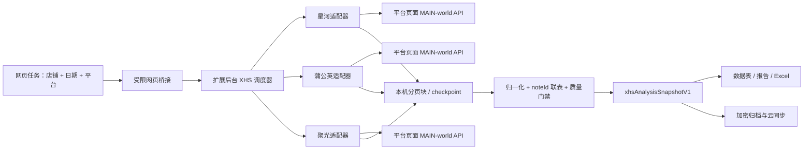

# 小红书三平台取数分析集成计划

状态：已确认，执行中（T01-T08 代码集成与发布回归已完成；T09 真实登录会话验收待执行）
目标仓库：`/Users/xinjiabo/AItools/光合插件优化/tbcontentdata`  
基线分支：`agent/unified-data-report-workflow`  
基线验证：2026-08-14 执行 `node --test tests/*.test.js`，30/30 通过

## 1. 目标与成功标准

把淘宝星河、蒲公英、聚光的取数、归一、联表和分析接入现有 Chrome 数据助手及 `tbdata.aizicheng.com` 网页工作台，同时保持现有淘宝四平台功能、历史归档和云同步兼容。

首个可发布版本完成时，用户应能：

1. 在网页工具选择店铺、日期范围和星河/蒲公英/聚光任务。
2. 默认从已解锁账号库读取所选店铺的默认凭据路由：星河用淘宝凭据直接登录淘宝星河，蒲公英与聚光共用小红书凭据并分别直接登录各自官方平台；也可显式回退到当前 Chrome 会话。全程不上传 Cookie、Token 或密码。
3. 分别看到三个平台的进度、分页完整性、平台内会话状态、异常与重试结果。
4. 按 `noteId` 查看达人合作成本、聚光消耗、星河进店/成交及任务期内外 ROI。
5. 在现有小红书经营数据表中自动填充可取指标，并保留清晰的手填兜底或显式覆盖。
6. 将脱敏、紧凑的分析快照归档并通过现有云同步往返；历史淘宝归档仍可打开。
7. 只有数据真正完整时才显示 `decisionReady=true`，任何截断、嵌套失败、登录失败、平台内会话未知或关键口径不一致都不能伪装成“完成”。

## 2. 范围与默认决策

### 本期范围

- 淘宝星河：项目、订单、店铺汇总、项目/订单汇总、订单内容明细。
- 蒲公英：“我的数据 → 笔记报告”的汇总和全量分页明细。
- 聚光：账户汇总、笔记汇总、按日且按营销诉求/投放模式拆分的笔记报表。
- 三平台本轮会话可用性、日期口径、分页/checkpoint、重试、取消与恢复；平台内身份仅用于本轮取数校验和缓存隔离，不持久化为店铺绑定。
- `noteId` 联表、成本/流量/转化/ROI、质量门禁和行动标签。
- 当前会话单店运行、网页展示、Excel/报告导出、本地归档和云同步。
- 当前聚光主账户可访问的广告账户发现、顺序采集和恢复原账户。

### 暂不纳入首发

- 蒲公英内容广场、达人榜单和聚光关键词工具。
- 服务端代登录或服务端直接请求平台 API。
- 多店批量运行与多套凭据切换；这放在第二阶段单独验收，并继续沿用账号库默认凭据路由，不新增平台身份绑定表。
- 原始平台响应上传云端。
- 直接改造历史发布物 `/Users/xinjiabo/AItools/小红书全链路工具`，或同时维护另一套 `xhs-fullchain` 实现。
- 自动部署生产环境；首发先产出通过测试的可安装包，部署另行确认。

### 默认业务口径（确认本计划即接受；也可在开工前修改）

- 日期默认最近 30 个完整自然日，时区 `Asia/Shanghai`；允许用户自定义起止日期。
- 达人合作总成本默认拆分展示“合作实付”和“平台服务费”，两者都计入管理口径总成本；原始组件始终保留，便于后续切换口径。
- 自动值默认优先；历史手填值仅在自动值缺失时兜底。用户主动开启“手工覆盖”后才覆盖自动值，并显示原因与来源。
- 聚光按当前登录主账户发现并顺序采集所有可访问广告账户，零消耗账户标记为“已验证无消耗”，不误报失败。
- 账号库 `credentialBindings` 保留为店铺的“默认凭据路由”：星河用淘宝默认凭据直登淘宝星河；蒲公英和聚光共用小红书默认凭据，分别直登各自官方平台，不先登录普通小红书网页。
- 旧 `xhsStoreAccountBindingsV1` 真实身份绑定、首次绑定、跨店错配门禁和解绑 UI 已退役。平台内不可逆账号标识只作为本轮可用性、来源追溯与缓存隔离证据，不建立平台身份 ↔ 店铺的持久映射；日期和运行上下文不一致时分析不可决策。

## 3. 目标架构

边界约束：

- 页面登录态只在用户本机 Chrome 中使用。
- MAIN world 仅执行白名单请求；ISOLATED content script 负责带 nonce/requestId 的消息转发。
- 分页块和 checkpoint 放在扩展本机 IndexedDB，默认在入库前去除签名 URL、Token、Cookie 和无关大字段。
- 云端只接收 `xhsAnalysisSnapshotV1` 与 `xhsCollectionStatusV1` 等紧凑快照，不接收分页块或原始响应。
- 新模块通过本地脚本导入，不把三套采集器继续堆进已超过 5000 行的 `background.js`。

## 4. 数据契约

### 4.1 统一运行状态

每个平台和每个必要子数据集至少包含：

- `platform`、`accountKey`、`dateRange`、`startedAt`、`finishedAt`。
- `status`: `running | complete | partial | failed | cancelled | verified_no_spend`。
- `expectedCount`、`receivedCount`、`pageCount`、`nextPage`、`fingerprint`。
- `truncated`、`warnings[]`、`errors[]`、`checkpoints[]`。
- `schemaValid`、`reconciled` 和接口版本/字段观察时间。

`complete` 的必要条件是：响应结构通过校验、所有必需分页结束、所有必需嵌套单元成功、没有人为页数/项目数/订单数截断，并通过平台内对账。仅有列表成功不能让星河整体完成。

### 4.2 可归档快照

新增两个稳定键：

- `xhsCollectionStatusV1`：本次运行、三个来源及子数据集的状态和质量摘要。
- `xhsAnalysisSnapshotV1`：管理汇总、平台汇总、项目/订单、笔记联表、质量问题、指标来源和行动建议。

快照必须有 `schemaVersion`、`runId`、`storeId`、平台来源摘要、日期范围、生成时间和迁移兼容逻辑。来源摘要用于本轮追溯，不形成平台身份 ↔ 店铺绑定。单个 XHS 分析快照设 8 MB 软上限，确保整条 run 明显低于现有 24 MB 云归档上限。

### 4.3 联表与口径

- 主键：规范化的 `noteId`。
- 辅助来源键：`contentId`、`orderId`、`projectId`、蒲公英合作订单、聚光 `advertiserId/vSellerId`。
- 星河 `contentId` 显式映射到 `noteId`，保留来源键以便追溯。
- 同笔记多合作、多订单和多账户必须先按来源规则聚合，再跨源关联；不能通过简单覆盖去重。
- 聚光日报用于判断星河任务期内/外；无日报时禁止输出任务期 ROI。
- 所有百分比、金额和人数保留数值及单位，展示层再格式化。

## 5. 实施任务

### T01 — 冻结契约、脱敏 fixture 和质量状态机

依赖：计划批准。  
主要文件：`xhs/contract.js`、`xhs/quality.js`、`tests/fixtures/xhs/`、`tests/xhs-contract.test.js`、`docs/xhs-data-contract.md`。

工作内容：

- 从现有 analyzer 提取并浏览器化字段契约，不引入 Node `fs/path`。
- 为三个平台建立最小成功、空数据、分页中断、结构漂移、嵌套失败和截断 fixture。
- fixture 清除真实用户名、达人身份、签名 URL、`xsec_token`、Cookie 和平台 Token。
- 实现统一状态机和 `decisionReady` 基础门禁。

验收标准：

- 任何缺少必要 `model/data/list/page` 的响应都失败或 partial，不能被当作空列表完成。
- `maxPages/maxOrders/maxProjects` 等人为限制一律产生 `truncated=true`。
- 星河任一相关项目/订单详情失败时整体至少为 partial。
- fixture 扫描测试确认没有已知敏感字段或 tokenized URL。

验证：`node --test tests/xhs-contract.test.js tests/xhs-security.test.js`。

### T02 — 安全页面桥、采集核心与可恢复本机缓存

依赖：T01。  
主要文件：`xhs/collector-core.js`、`xhs/local-cache.js`、`xhs/page-client.js`、`xhs-platform-content.js`、三个 `*-page-hook.js`、`manifest.json`、`background.js`、`cloud-tool/scripts/sync-web-tool.mjs`。

工作内容：

- 建立统一 adapter 接口：`identify`、`collect`、`resume`、`cancel`、`normalizeStatus`。
- 实现超时、指数退避、限速、查询 fingerprint、幂等分页和 MV3 service worker 恢复。
- page hook 仅接受当前 origin 的白名单 method/path，消息包含 channel、nonce、requestId 和大小限制。
- 添加精确的蒲公英/聚光 host 权限、content script 和打包资源清单。

验收标准：

- 非白名单 origin、method、path 和超限 payload 都被拒绝。
- 模拟 service worker 中断后可从最后完整页继续，且不重复累计。
- 缓存不会进入账户归档白名单或云同步请求。
- 构建生成的扩展 ZIP 包含所有新增本地脚本。

验证：桥接安全、恢复、Manifest 和打包清单测试。

### 检查点 A — 基础设施评审

运行根测试；检查契约、敏感字段扫描和恢复测试。只有 A 通过才接真实平台。

### T03 — 淘宝星河纵向切片

依赖：T02。  
主要文件：`xhs/adstar-collector.js`、`xhs/adstar-normalize.js`、星河 page hook、`background.js`、对应测试。

工作内容：

- 接入项目列表、订单列表、全店汇总、项目汇总/明细、订单汇总/明细。
- 仅展开与日期范围有交集的项目/订单；记录列表总数、相关数和排除理由。
- 所有相关项目/订单的嵌套 checkpoint 纳入总状态。
- 将订单内容 `contentId` 映射为 `noteId`；未知投放模式保留 `unknown` 并告警，不退化为看似有效的 `all`。

验收标准：

- fixture 契约覆盖请求参数、token 动态获取、分页结构、嵌套 partial 和字段漂移。
- 7 天真实 smoke 能完成全部相关项目/订单，或准确显示 partial 及具体失败单元。
- 不在日志、快照或错误消息中保存 `_tb_token_` 和带 token 的 URL。

验证：星河 fixture 测试 + 登录会话下 7 天全量 smoke。

### T04 — 蒲公英纵向切片

依赖：T02。  
主要文件：`xhs/pgy-collector.js`、`xhs/pgy-normalize.js`、蒲公英 page hook、对应测试。

工作内容：

- 接入账号身份、“笔记报告” `/sum` 和 `/list` 全量分页。
- 规范化笔记、达人、合作成本、平台服务费、发布时间和内容表现字段。
- 对账服务端总条数、客户端唯一笔记数、汇总成本与明细成本。
- 明确日期筛选是“笔记发布时间”，并在 UI 和快照中显示该口径。

验收标准：

- 当前 131 条样本能够跑完全量，而不是停在 30/131。
- 登录失败、平台内会话身份未知、总数不一致、重复笔记或分页中断都会产生可见质量问题。
- 成功的零结果与接口/结构失败可区分。

验证：蒲公英 fixture/对账测试 + 当前登录账号全量 smoke。

### T05 — 聚光纵向切片

依赖：T02。  
主要文件：`xhs/juguang-collector.js`、`xhs/juguang-accounts.js`、`xhs/juguang-normalize.js`、聚光 page hook、对应测试。

工作内容：

- 发现当前主账户下可访问广告账户，逐个校验、采集并恢复初始账户。
- 采集账户汇总、笔记周期汇总、按日/营销诉求/投放模式拆分明细。
- 固化转化时间口径和 15 天归因窗口元数据；对账周期与日报消耗。
- 零消耗账户只保存身份和验证结果，不拉空分页。

验收标准：

- 账户切换后 `advertiserId/accountType/vSellerId` 必须与目标一致，否则立即停止该账户。
- 所有有消耗账户的汇总和日报完整；不支持列、枚举识别率低或差异超过 1% 时质量门禁可见。
- 3 天真实 smoke 的 33 条汇总/89 条日报证据可由当前代码重新生成。

验证：账户/报表 fixture 测试 + 多广告账户 smoke。

### 检查点 B — 三个平台独立可用

分别演示三平台当前会话运行、失败恢复和状态页；任何平台仍有“假完成”则不进入联表。

### T06 — 三平台归一、联表、指标映射和决策门禁

依赖：T03、T04、T05。  
主要文件：`xhs/analysis.js`、`xhs/metrics.js`、`xhs/quality.js`、`diagnosis-spec.js`、`diagnosis-popup.js`、对应测试。

工作内容：

- 移植并拆分现有 analyzer 的纯分析逻辑，修复当前只检查顶层列表的质量缺口。
- 建立笔记、订单、项目、店铺四层聚合；笔记真实成本唯一归属后向订单、项目和店铺逐层求和，禁止均摊或推算。
- 映射现有小红书指标：达人/聚光花费、产品种草/种草直达、星河进店、店铺 GMV、任务 GMV、ROI 等。
- 报备笔记数自动取蒲公英；水下笔记数继续手填，并新增可追溯的合计公式。
- DMP 现有自动值继续复用，不让新 XHS 快照覆盖 DMP 人群结果。
- `decisionReady=false` 时行动建议只能是观察/补数，不输出放量或停止结论。

验收标准：

- 同一 `noteId` 的三源数据可稳定合并；重复、多订单、多账户和任务期重叠有确定规则及测试。
- 自动/手填兜底/显式覆盖均显示来源、时间、账号和日期范围。
- 完整 fixture 可得到 `decisionReady=true`；逐项删除关键数据都能得到对应 critical issue。
- 生成的紧凑快照不含签名 URL或原始大对象，大小小于 8 MB。

验证：归一、联表、指标、质量、兼容和快照大小测试。

### T07 — 网页任务、数据表、分析报告与导出

依赖：T06。  
主要文件：`web-tool/report.html`、`web-tool/task.js`、`web-tool/data.html`、`diagnosis-popup.js`、`web-tool/report-view.html`、`web-tool/report.js`、样式和导出测试。

工作内容：

- 平台选择器新增星河、蒲公英、聚光，并为 XHS 任务增加日期范围。
- 状态区展示三个来源及嵌套进度、账号、完整性、重试和告警。
- 现有小红书 23 指标表改为自动值优先，并提供手工覆盖开关。
- 报告从同一份三源对齐快照投影出淘宝星河、蒲公英、聚光三份平台报告；星河报告承载对齐后的经营概览、项目/订单和笔记联表。
- Excel 至少包含管理汇总、笔记联表、项目/订单、聚光日报、星河明细和质量说明六类 sheet。

验收标准：

- 当前任务和历史归档使用同一渲染路径；旧 schema 2 淘宝报告不报错。
- partial/failed/verified-no-spend 在网页和导出中语义一致。
- 不再出现“四个平台”硬编码文案或遗漏新增平台的进度计算。
- 键盘操作、表格横向滚动、空态和超长错误信息可用。

验证：网页 DOM/渲染、归档导航、导出和无障碍基础测试。

### T08 — 统一调度、归档桥、云同步和发布资源

依赖：T06、T07。  
主要文件：`background.js`、`web-tool-bridge.js`、`web-tool/cloud-sync.js`、`cloud-tool/scripts/sync-web-tool.mjs`、归档与云端测试。

工作内容：

- 注册三个新平台任务；星河、蒲公英、聚光跨平台并行，同一平台内的分页和账号切换继续严格串行，三源全部结束后再统一联表。
- 统一取消、重试、部分成功、运行状态和归档失败说明。
- 原子更新 readable/clearable/archive/platform/capability 等所有静态白名单。
- 归档只加入两个紧凑 XHS 键；导入时校验 schema、大小和敏感字段。
- 运行网页资源同步，确认 `public/`、受保护页面和扩展 ZIP 都由源文件生成。

验收标准：

- 三个 XHS 任务和四个淘宝任务可独立勾选；最大并发可控，不因一个失败取消其他已完成结果。
- 新 run 本地归档、加密上传、下载、导入和重新渲染完整往返。
- 旧 run、旧手填数据和旧云端对象仍可读取。
- 24 MB 边界测试通过，raw/checkpoint 永远不进入上传 payload。

验证：编排、partial 传播、bridge、云同步和迁移 round-trip 测试。

### 检查点 C — 端到端候选版本

根测试全部通过；云站点 lint/build/test 通过；完成一个不依赖真实账号的 fixture 端到端演示。

完成证据（2026-08-14）：根回归 229/229，其中 XHS 契约与集成 199/199；云站点 lint 通过，Web 构建测试 75 通过/4 跳过，Node 生产测试 20/20；Docker/受保护资源 10/10，扩展 ZIP 可重复生成且与源文件逐字节一致。

### T09 — 真实全链路验收、文档和候选发布包

依赖：T08。  
主要文件：README、使用说明、版本、测试证据和生成包。

工作内容：

- 当前真实账号分别运行 7 天和 30 天三平台全量任务。
- 人为中断一次分页，验证恢复；验证登录失败、平台内会话未知、零消耗、单平台失败和云端往返。
- 对照平台页面抽查总花费、笔记数、进店、GMV 和至少 5 条笔记联表。
- 更新安装、权限、日期口径、成本口径、隐私和故障恢复文档。
- 生成候选扩展 ZIP；不自动部署生产。

验收标准：

- 7 天和 30 天至少各有一次三平台 `decisionReady=true` 的运行证据。
- 三个平台总数/金额在约定误差内；所有抽样笔记能追溯来源。
- 根目录 30 项现有基线测试无回归，新增测试通过。
- `cloud-tool` 的 `npm run lint`、`npm test`、`npm run test:node` 全部通过。
- 候选包不包含 fixture 原始敏感数据、调试缓存或本地环境文件。

### T10 — 第二阶段：多店默认凭据路由与批跑（原身份绑定方案已退役）

依赖：首发候选版本验收和单独确认。

- 原拟建立淘宝账号、星河身份、蒲公英身份和聚光广告账户组合式绑定的方案已退役；不再使用 `xhsStoreAccountBindingsV1`，也不提供首次绑定、跨店错配门禁或解绑 UI。
- `credentialBindings` 继续作为账号库的默认凭据路由，并保持现有密文兼容：星河使用店铺淘宝默认凭据直登淘宝星河；蒲公英与聚光共用店铺小红书默认凭据，分别直登各自官方平台。
- 小红书流程不先登录普通小红书网页，也不建立星河、蒲公英或聚光平台身份与店铺的额外绑定；登录或采集期间的验证码/安全验证仍交由人工完成，单店任务在验证通过后自动继续受影响步骤。
- 后续若开放多店批跑，应按店铺顺序读取默认凭据路由、隔离每轮缓存并记录来源摘要；验收关注登录成功、缓存隔离、日期与 runId 一致性，不恢复旧身份注册表。

## 6. 风险与控制

| 风险 | 控制方式 |
| --- | --- |
| 页面 API 或字段漂移 | 响应 schema 校验、脱敏 fixture、未知字段保留、缺必需字段即 partial/failed |
| 星河嵌套失败仍显示完成 | 每个相关项目/订单的 checkpoint 纳入父状态；错误计数必须为 0 |
| 三个平台日期或运行上下文串号 | 每轮来源摘要 + dateRange/runId 指纹、缓存隔离与全源证据门；不建立跨运行平台身份 ↔ 店铺映射 |
| MV3 service worker 被挂起 | IndexedDB 分页块、幂等 fingerprint、恢复测试 |
| 7 个平台同时运行触发限流 | XHS 三源按独立 origin 并行、每个平台内部串行、全局有限并发、退避与取消 |
| Token/签名 URL/业务隐私泄露 | 入库脱敏、桥接白名单、敏感字段扫描、raw 不归档不上云 |
| 云端 run 超过 24 MB | 8 MB XHS 软上限、紧凑字段、上传前大小门禁 |
| 静态白名单漏改导致数据静默丢失 | 一份契约驱动测试同时核对 background、bridge、archive、sync 和 zip 清单 |
| 手填旧值覆盖新自动值 | 旧值仅兜底；显式覆盖需开关、原因和来源标记 |
| 继续扩大单体文件 | 三平台 adapter、分析和存储独立模块；background 只保留调度接线 |

## 7. 总体验收定义

只有同时满足以下条件才算本次集成完成：

- 三平台独立采集、恢复、归一和契约测试通过。
- 真实 7 天与 30 天三平台运行均有完整证据，且至少一次 `decisionReady=true`。
- 网页当前任务、归档查看、报告和 Excel 展示一致。
- 旧淘宝流程、旧归档和旧手填数据兼容。
- 云同步 round-trip、大小边界和敏感字段扫描通过。
- 候选扩展包和站点构建通过，但生产部署仍等待明确授权。

## 8. T11 — 小红书经营报告 v2（2026-08-18 已确认）

### 目标

在不改变账号库默认凭据路由、平台内本轮会话校验、分页和质量门禁的前提下，重构小红书报告的数据口径与展示结构：蒲公英严格按笔记发布时间筛选，聚光支持账户/诉求/模式的单层与多层分析，星河改为全店→项目→订单→笔记层级，笔记真实成本唯一归属后逐层求和且不做均摊；笔记联表仅以所选时间段内星河有数据的笔记为根集合。

### 固定口径

- `P_R`：蒲公英中发布时间落在所选上海自然日闭区间的去重笔记；服务端日期参数只作请求优化，分析层必须本地二次筛选。
- `S_R`：所选日期内存在有效星河日报指标的去重笔记。
- `J_R`：所选日期内聚光日报；任务状态 `unknown` 单列，不并入任务期外。
- 达人花费 `P`：`P_R` 的合作实付 + 平台服务费；粉丝档位平均合作费用只取合作实付。
- 账户总投入：`P + J_all`；星河归因投入：`P + J_in`。
- 任务 ROI：任务商品 GMV / 星河归因投入；任务外直达 ROI：任务外直达 15 日 GMV / 对应直达消耗；直达 ROI：全部直达 15 日 GMV / 全部直达消耗。
- 星河主漏斗展示“阅读 UV”，另列“搜索曝光 UV”；进店率按进店 UV / 阅读 UV。
- 项目、订单保留平台原生指标；达人费与任务期内广告费来自其唯一归属笔记的真实成本求和上卷，不均摊、不推算，不计算分摊 ROI；项目下嵌套所属订单，订单下嵌套笔记。
- 笔记联表根集合为 `S_R`；发布期外蒲公英金额可展示，但明确不计入本期达人花费。

### 垂直切片

#### T11.1 — 报告数据契约与纯函数测试

**验收标准：**

- 蒲公英本地日期闭区间、去重、月份补零、粉丝档边界及加权阅读/互动率有确定测试。
- 聚光 1–3 个 allowlist 维度的筛选/分组、四象限消耗和未知桶可完全对账。
- 星河任务 GMV 使用任务商品 GMV；账户、全店及直达三类 ROI 公式一致。

**验证：** `node --test tests/xhs-report-model.test.js tests/xhs-analysis.test.js`。

#### T11.2 — 蒲公英字段与期间分析

**验收标准：**

- 采集投影保留 `kolFanNum -> author.followerCount`，缺失为 `null`，不增加新接口。
- 期间笔记数、费用、曝光/阅读/互动全部由筛选后的明细重算，不采用全账户 `/sum` 作为期间值。
- 输出月度发布量、五档粉丝图、1K 以下/未知排除数、星河任务笔记数。

#### T11.3 — 聚光多维模型

**验收标准：**

- `spotlight.daily` 保留平台原始 `externalRoi15`，同时保留聚合重算 ROI。
- 支持 `account / marketingObjective / deliveryMode` 任意单层或有序多层分组与独立筛选。
- 每组输出总消耗、任务内/外/未知消耗、曝光、点击、互动、种草/深种草人群及直达 15 日进店/订单/GMV/ROI。

#### T11.4 — 星河层级与账户总览

**验收标准：**

- 全店使用 `storeSummary` 原值；项目与订单使用各自 summary，UV 不跨层相加。
- 项目输出嵌套订单、订单输出嵌套笔记；笔记真实成本唯一归属后向上求和，报告不出现 `allocatedCost` 或基于分摊成本的 ROI。
- 账户级输出总投入、达人花费、全部广告花费、任务内外 × 产品种草/种草直达消耗，以及三种 ROI。

#### T11.5 — 网页报告、交互与导出

**验收标准：**

- 蒲公英月度与粉丝档图表可键盘访问，并提供表格/空态替代信息。
- 聚光分组层级和筛选均为 allowlist 控件，当前报告与历史归档共用渲染路径。
- 笔记表只显示 `S_R`，并标明蒲公英金额是否计入本期。
- Excel/HTML 导出与网页指标、公式和空值语义一致。

### 检查点 D — 报告 v2 候选

- focused 测试、根测试和 cloud 测试全绿。
- 源文件、`cloud-tool/public` 与受保护 ZIP 逐字节一致。
- 使用脱敏 fixture 验证单层、多层、空数据、缺粉丝、未知任务状态、产品种草不可观测及 partial 状态。
- 候选包完成后再由用户进行真实运行验收。

完成证据（2026-08-18）：报告/采集 focused 98/98，根回归 391/391，Cloudflare 构建回归 75 通过/4 跳过，cloud lint 与 TypeScript 通过，Node 生产构建成功，受保护资源 4/4、Node 生产入口 20/20；源文件、cloud public、受保护页面和 v2.37.12 扩展 ZIP 由同一次同步生成。生产部署与真实账号验收仍需用户确认。

## 9. T15 — 小红书经营报告 v3（2026-08-24 已确认）

批准规格：根目录 `CAPABILITY-MAP-xhs-report-v3.md` 及四份 `SPEC-*.md`。

### 架构决策

- 蒲公英采集范围与报告范围解耦：采集全部可用事实，任务日期仅作报告默认筛选。
- 聚光只接受真实 `placementType`；旧 `deliveryMode` 不做语义重映射。
- 星河项目/任务只渲染汇总，笔记统一进入独立筛选表。
- 报告交互只重算归档事实，不在筛选时请求平台。

### 纵向切片

1. `pgy-latest-snapshot`：全量分页、紧凑事实、共享日期聚合、旧归档兼容。
2. `juguang-placement-metrics`：位置拆分、产品种草站外 UV/成本、真实请求验证。
3. `star-rollup`：项目/任务汇总视图，移除嵌套笔记展示。
4. `note-explorer`：三类筛选、费用公式、Top20 与查看更多。
5. 同步发布资源，运行根测试、云端镜像测试和真实浏览器验收。

### 风险与控制

| 风险 | 控制 |
| --- | --- |
| 蒲公英全历史快照过大 | 紧凑事实 + 8 MiB 高基数测试 |
| `placementType` 不支持拆分 | 真实账号请求验证；失败不回退为 `deliveryMode` |
| 新筛选误改星河固定口径 | 蒲公英筛选与星河任务日期分离，分别测试 |
| 旧归档缺新字段 | 禁用不可支持控件，显示未知而非伪造数据 |

### 完成门禁

- 每个切片有先失败后通过的 focused 测试。
- 根测试全绿，语法与 `git diff --check` 通过。
- 本地/cloud 报告资源一致。
- 使用“梦想家”新归档验证蒲公英全量、聚光位置/站外指标和星河笔记交互。
